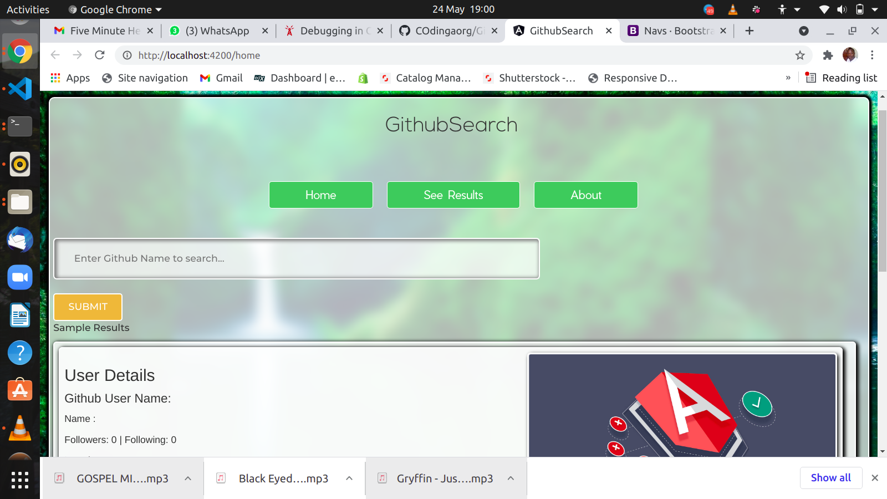
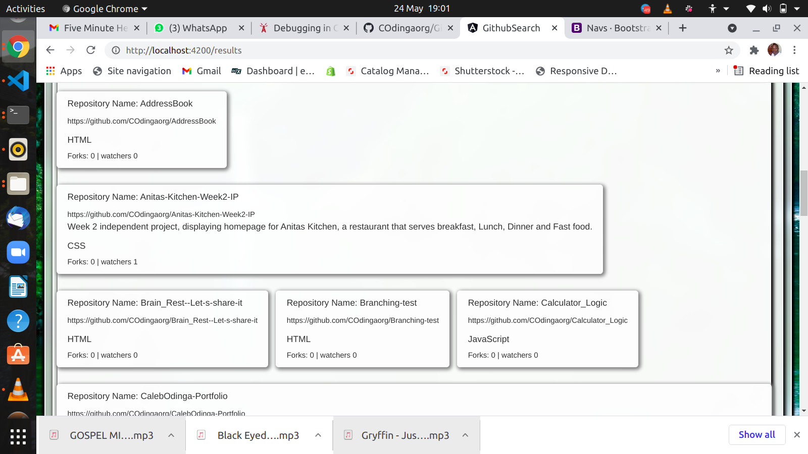

## Author
Caleb Ouma Odinga 

## GitHub Search
THis is a website that allows a user to inut a name and it in Github. It uses Github api and angular framework.
THe results are limited to one per name. After a username is searched, the user can also be able to see repositories associated to the username, with selected details, including name, descrition, forks and watchers.

# User journey.
A user visits the site.
A user types in the search term they want information about, 
A user submits the term by clicking submit button

# Output
A user sees the results including user details and repositories associated with the account.

A user can also navigate to see results page and about page by navigating the buttons in the header.

# Homepage

# Sample Results

## Installation
Have angular CLI installed in you machine.

Use git, Github and any editor or IDE to see the codes and the rendered frontend.

## Usage

Ensure you have Angular CLI installed in you machine. Clone this github repository, git ull to your local machine and code away. ng serve to load the project in your server.

## Contributing
Pull requests are welcome. For major changes, please open an issue first to discuss what you would like to change.

Please make sure to update tests as appropriate.

## Website's link
to view Live click Here--https://COdingaorg.github.io/GitHub-Search/

## License
This Website uses MIT LICENSE. For more Read License.

Copyright (c) 2021 Caleb Odinga